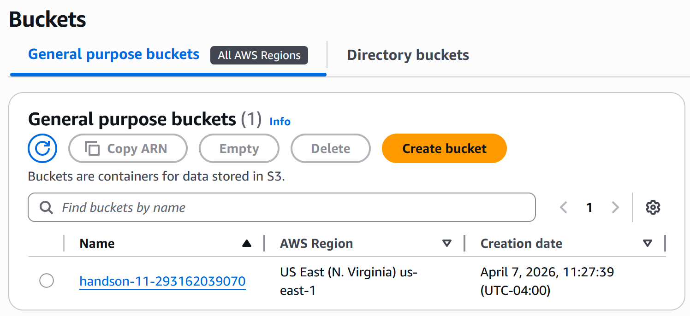
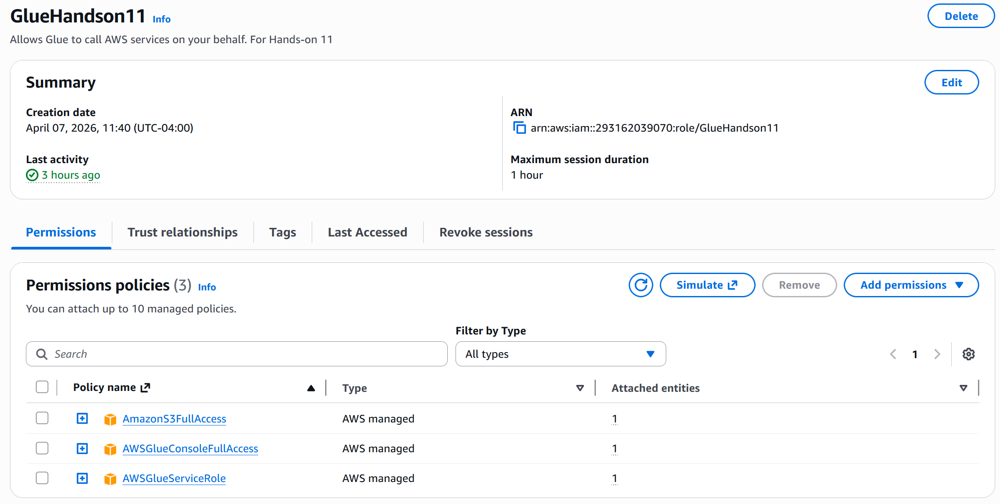
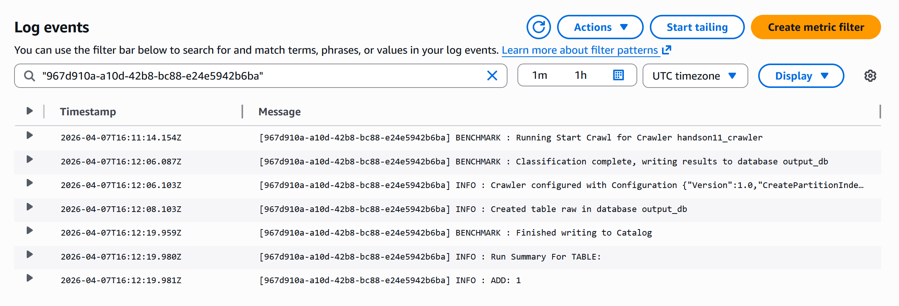

# HandsOnL11_AWS_Core_Services

## S3 Bucket Creation

First, I created the S3 bucket to store the provided csv file.

## IAM Role

The next step after creating the S3 bucket was to create an IAM role for a crawler to use to access the bucket.

## CloudWatch Crawler Status

After setting up the bucket and the role, I created the Glue crawler to access the bucket & monitored its progress via CloudWatch.

